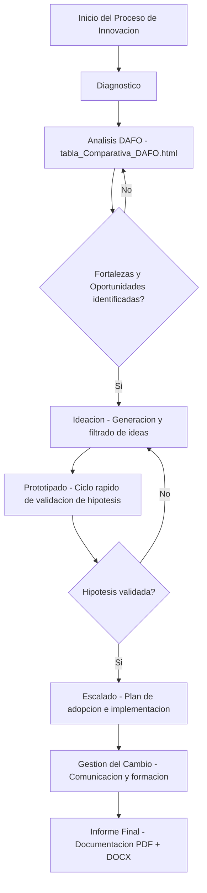

# Definición de un Proceso de Innovación Tecnológica

> Definición y modelado de un proceso de innovación tecnológica con análisis DAFO y gestión del cambio.

## Descripción

---

Proyecto de definición de un proceso estructurado de innovación tecnológica para organizaciones del sector TI. Se aplica el análisis **DAFO** para diagnosticar el estado actual, se define la metodología de ideación, prototipado y validación, y se establece un plan de gestión del cambio para la adopción de la innovación.

## Contenido

| Archivo | Descripción |
|---|---|
| `*.pdf` | Informe de definición del proceso de innovación |
| `tabla_Comparativa_DAFO.html` | Análisis DAFO interactivo |
| `*.docx` | Desarrollo y documentación del proyecto |

## Fases del proceso de innovación modelado

1. **Diagnóstico:** Análisis DAFO del entorno y capacidades organizacionales
2. **Ideación:** Metodología de generación y filtrado de ideas
3. **Prototipado:** Ciclo rápido de validación de hipótesis
4. **Escalado:** Plan de adopción e implementación
5. **Gestión del cambio:** Estrategia de comunicación y formación

## Contexto académico

**Asignatura:** Dirección y Gestión de Empresas TI · **Institución:** UNIR · Ingeniería Informática
**Autor:** Alejandro De Mendoza — Ingeniero Informático · Especialista IA · Máster Arquitectura de Software

---

## Arquitectura

## Autor

**Alejandro De Mendoza**  
Ingeniero Informático · Especialista en IA · Especialista en Ingeniería de Software · Máster en Arquitectura de Software

